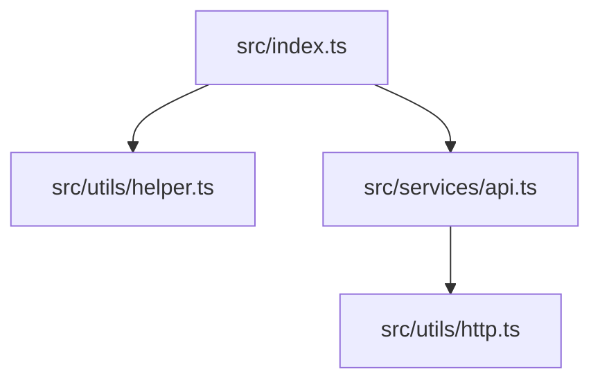
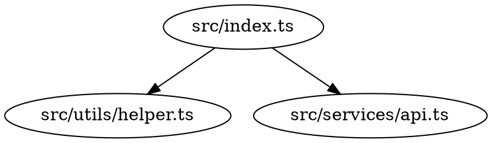

# Architecture Visualizer MCP

An MCP server for codebase architecture analysis, providing dependency graphs, circular dependency detection, and complexity metrics.

## Installation

```bash
npm install
npm run build
```

## Configuration

Add to your Claude Desktop config:

```json
{
  "mcpServers": {
    "architecture-visualizer": {
      "command": "node",
      "args": ["/path/to/architecture-visualizer-mcp/dist/index.js"]
    }
  }
}
```

## Tools

### generate_dependency_graph

Create visual dependency graphs in multiple formats.

**Input:**
| Parameter | Type | Required | Description |
|-----------|------|----------|-------------|
| path | string | Yes | Project root path |
| format | string | No | Output format: "mermaid", "dot", or "json" (default: "mermaid") |
| depth | number | No | Maximum dependency depth (default: unlimited) |
| exclude | array | No | Glob patterns to exclude |
| language | string | No | "typescript", "javascript", or "python" (auto-detected) |
| includeExternal | boolean | No | Include external dependencies (default: false) |

**Example:**
```json
{
  "path": "/path/to/project",
  "format": "mermaid",
  "exclude": ["**/*.test.ts", "**/node_modules/**"],
  "depth": 3
}
```

**Output Formats:**

*Mermaid:*


*DOT (Graphviz):*


*JSON:*
```json
{
  "nodes": ["src/index.ts", "src/utils/helper.ts"],
  "edges": [{"from": "src/index.ts", "to": "src/utils/helper.ts"}]
}
```

---

### detect_circular_dependencies

Find circular imports using Tarjan's strongly connected components algorithm.

**Input:**
| Parameter | Type | Required | Description |
|-----------|------|----------|-------------|
| path | string | Yes | Project root path |
| language | string | No | "typescript", "javascript", or "python" |
| exclude | array | No | Glob patterns to exclude |
| maxCycles | number | No | Maximum cycles to report (default: 50) |

**Output:**
- List of dependency cycles with file paths
- Severity level: "none", "low", "medium", "high", "critical"
- Actionable suggestions for resolution

**Example:**
```json
{
  "path": "/path/to/project",
  "language": "typescript"
}
```

**Sample Output:**
```json
{
  "cycles": [
    {
      "files": ["src/a.ts", "src/b.ts", "src/a.ts"],
      "length": 2
    }
  ],
  "severity": "medium",
  "suggestions": [
    "Extract shared types to a separate module",
    "Use dependency injection to break the cycle",
    "Consider lazy imports for runtime dependencies"
  ]
}
```

---

### map_module_relationships

Analyze module coupling, cohesion, and relationships.

**Input:**
| Parameter | Type | Required | Description |
|-----------|------|----------|-------------|
| path | string | Yes | Project root path |
| groupBy | string | No | Grouping: "directory", "package", "feature", or "layer" |
| language | string | No | "typescript", "javascript", or "python" |
| exclude | array | No | Glob patterns to exclude |
| depth | number | No | Directory depth for grouping |

**Output:**
- Module list with file counts and dependencies
- Relationships between modules
- Coupling metrics:
  - **Afferent coupling (Ca)**: Incoming dependencies
  - **Efferent coupling (Ce)**: Outgoing dependencies
  - **Instability (I)**: Ce / (Ca + Ce)
- Cohesion score

**Example:**
```json
{
  "path": "/path/to/project",
  "groupBy": "directory"
}
```

**Sample Output:**
```json
{
  "modules": [
    {
      "name": "src/services",
      "files": 5,
      "internalDependencies": 3,
      "externalDependencies": 2
    }
  ],
  "relationships": [
    {"from": "src/services", "to": "src/utils", "strength": 4}
  ],
  "metrics": {
    "averageCoupling": 2.3,
    "cohesionScore": 0.75,
    "instability": 0.45
  }
}
```

---

### analyze_complexity

Calculate cyclomatic complexity and maintainability metrics per file and function.

**Input:**
| Parameter | Type | Required | Description |
|-----------|------|----------|-------------|
| path | string | Yes | Project root path |
| threshold | number | No | Complexity threshold for warnings (default: 10) |
| language | string | No | "typescript", "javascript", or "python" |
| exclude | array | No | Glob patterns to exclude |

**Output:**
- Per-file complexity scores
- Per-function complexity breakdown
- Hotspots exceeding threshold
- Maintainability index
- Average complexity

**Complexity Ratings:**
| Score | Rating |
|-------|--------|
| 1-5 | Low (simple) |
| 6-10 | Moderate |
| 11-20 | High (consider refactoring) |
| 21+ | Very High (refactor recommended) |

**Example:**
```json
{
  "path": "/path/to/project",
  "threshold": 15,
  "language": "typescript"
}
```

**Sample Output:**
```json
{
  "files": [
    {
      "path": "src/utils/parser.ts",
      "complexity": 25,
      "maintainabilityIndex": 45,
      "functions": [
        {"name": "parseExpression", "complexity": 18, "line": 45}
      ]
    }
  ],
  "hotspots": [
    {"path": "src/utils/parser.ts", "function": "parseExpression", "complexity": 18}
  ],
  "averageComplexity": 8.5
}
```

---

### get_architecture_overview

Generate a high-level architecture summary with layer detection.

**Input:**
| Parameter | Type | Required | Description |
|-----------|------|----------|-------------|
| path | string | Yes | Project root path |
| language | string | No | "typescript", "javascript", or "python" |
| exclude | array | No | Glob patterns to exclude |

**Output:**
- Detected architectural layers (presentation, business, data, infrastructure, utility)
- Entry points
- External dependencies with categories
- Architecture style classification
- Mermaid diagram

**Layer Detection:**
- **Presentation**: components, views, pages, ui, frontend
- **Business**: services, domain, core, business, logic
- **Data**: models, entities, repositories, database, db
- **Infrastructure**: config, infrastructure, adapters, external
- **Utility**: utils, helpers, common, shared, lib

**Example:**
```json
{
  "path": "/path/to/project"
}
```

**Sample Output:**
```json
{
  "layers": [
    {"name": "presentation", "files": ["src/components/*"], "percentage": 30},
    {"name": "business", "files": ["src/services/*"], "percentage": 25},
    {"name": "data", "files": ["src/models/*"], "percentage": 20}
  ],
  "entryPoints": ["src/index.ts", "src/main.ts"],
  "externalDependencies": [
    {"name": "react", "category": "framework", "usageCount": 45},
    {"name": "axios", "category": "http", "usageCount": 12}
  ],
  "architectureStyle": "layered",
  "diagram": "graph TD\n  Presentation --> Business\n  Business --> Data"
}
```

## Supported Languages

| Language | Import Styles |
|----------|---------------|
| TypeScript | ESM imports, require(), dynamic imports |
| JavaScript | ESM imports, CommonJS require(), dynamic imports |
| Python | import, from...import, relative imports |

## Features

- **Multi-Language**: TypeScript, JavaScript, and Python support
- **Efficient Algorithms**: Tarjan's SCC for cycle detection
- **Multiple Output Formats**: Mermaid, DOT, JSON
- **Configurable Analysis**: Exclude patterns, depth limits, thresholds
- **Comprehensive Metrics**: Coupling, cohesion, complexity, maintainability

## Dependencies

- `typescript` - TypeScript compiler API
- `@babel/parser` - JavaScript/TypeScript parsing
- `graphlib` - Graph data structures and algorithms
- `@modelcontextprotocol/sdk` - MCP protocol
- `zod` - Input validation

## License

MIT
